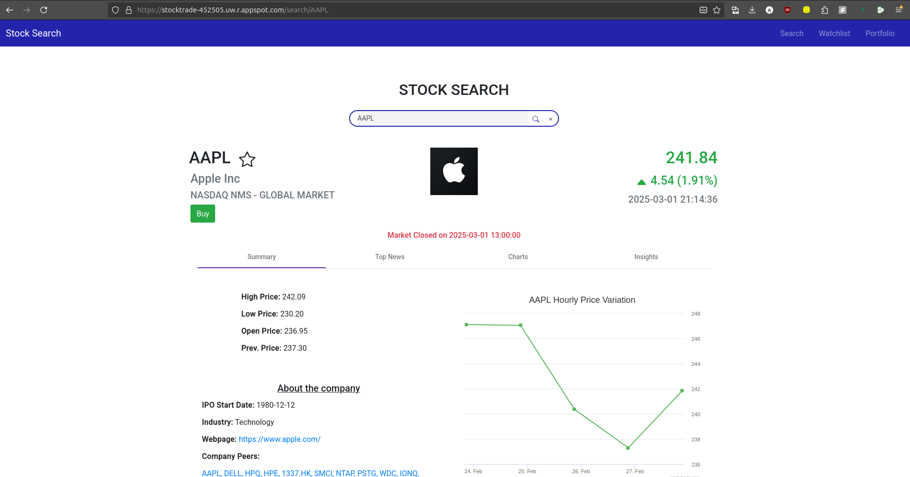
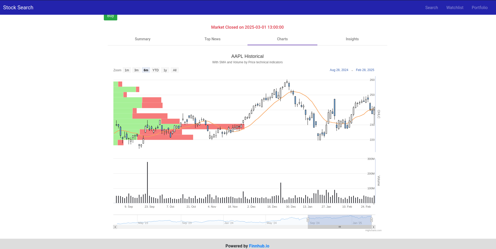
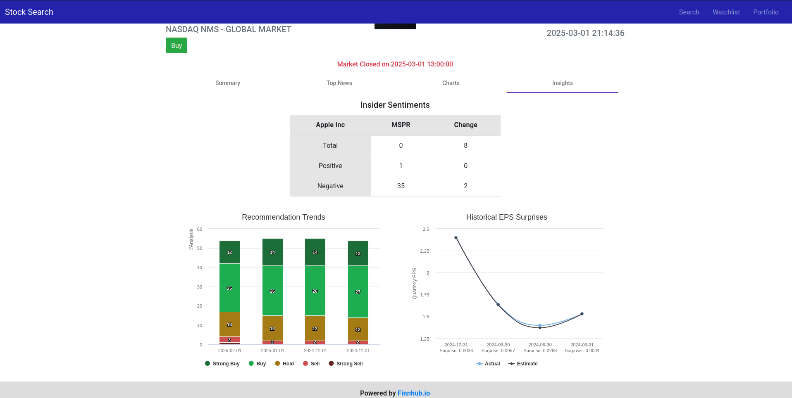

# Stock Search and Portfolio Management Web Application

## Overview

### View the live app at : [https://stocktrade-452505.uw.r.appspot.com](https://stocktrade-452505.uw.r.appspot.com/)

This comprehensive stock market web application, provides users with real-time stock data, watchlist functionality, and portfolio management. It leverages modern web technologies to deliver a responsive and interactive experience for stock market enthusiasts.

## Screenshots





## Features

### Stock Search
- Autocomplete suggestions for stock symbols
- Detailed company profiles upon selection

### Stock Details
- Real-time stock quotes with price, change, and market status
- Company information including logo, description, and key statistics
- Interactive price charts with multiple timeframes
- Latest news articles related to the stock
- Financial metrics and analyst recommendations

### Watchlist
- Add/remove stocks to a personal watchlist
- Real-time updates for watchlist items
- Persistent storage using MongoDB Atlas

### Portfolio
- Simulated trading with $25,000 starting balance
- Buy and sell stocks at real-time prices
- Track profits, losses, and overall portfolio performance
- Transaction history and current holdings view

### Responsive Design
- Seamless experience across desktop, tablet, and mobile devices
- Adaptive layout using Bootstrap grid system


This project demonstrates a microservices architecture implemented in Go, showcasing various services and their interactions.

## Project Structure

The project consists of the following main components:

- `auth-service`: Handles user authentication and authorization
- `product-service`: Manages product-related operations
- `order-service`: Handles order processing and management
- `api-gateway`: Acts as an entry point for client requests and routes them to appropriate services
- `common`: Contains shared utilities and models used across services

## Services

### Auth Service

The auth service is responsible for user authentication and authorization. It provides endpoints for:

- User registration
- User login
- Token validation

### Product Service

The product service manages product-related operations, including:

- Creating new products
- Retrieving product information
- Updating product details
- Deleting products

### Order Service

The order service handles order processing and management, including:

- Creating new orders
- Retrieving order information
- Updating order status
- Cancelling orders

### API Gateway

The API gateway serves as the entry point for client requests and routes them to the appropriate microservices. It handles:

- Request routing
- Authentication middleware
- Rate limiting

## Getting Started

1. Ensure you have Go installed on your system (version 1.16 or later recommended).

2. Clone the repository:
   ```
   git clone https://github.com/yourusername/Go-Lang-MicroServices.git
   cd Go-Lang-MicroServices
   ```

3. Install dependencies for each service:
   ```
   go mod tidy
   ```

4. Start each service individually:
   ```
   go run auth-service/main.go
   go run product-service/main.go
   go run order-service/main.go
   go run api-gateway/main.go
   ```
